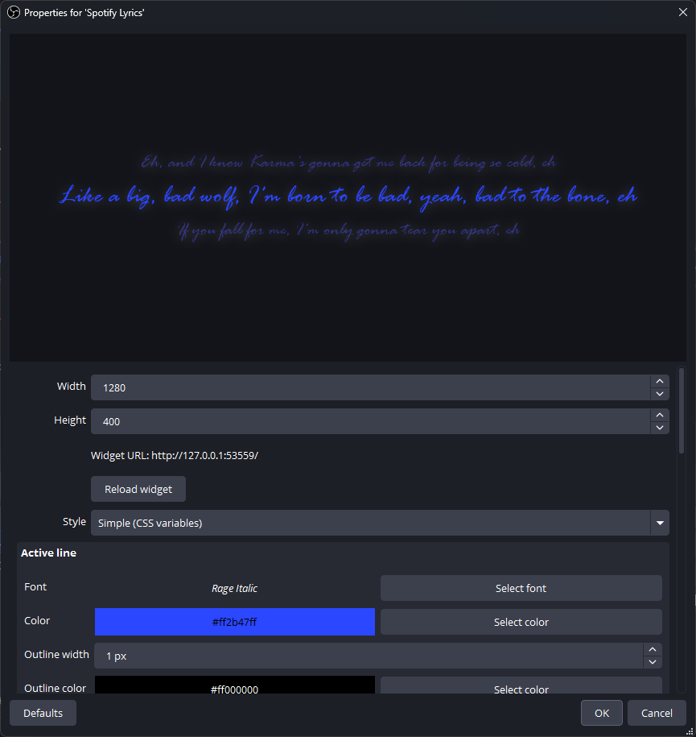
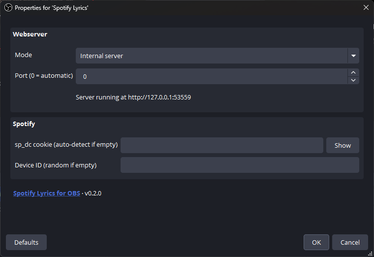

   
  <h1>Spotify Lyrics for OBS</h1>
  
Display the currently playing Spotify track's lyrics as a customizable HTML widget right inside OBS Studio.

  

https://github.com/user-attachments/assets/833cb81e-6676-4127-8830-0d3772de502a

  

If you as a streamer enjoy Karaoke and use Spotify for it, or if you just want
to give your stream chat an opportunity to actually understand the lyrics of the
Spotify tracks you listen to in the background, then this is the perfect
customizable solution for you.

## Installation

People wanting to get an out-of-the-box working experience can just grab the
OBS plugin/setup for their respective platform. See the
[Requirements](#requirements) section for what you need to have set up first.

## What's inside

This comes with everything necessary to render the lyrics of your Spotify tracks
to the stream:

1.  **Lyrics server** that talks to Spotify to download lyrics for the
    currently playing song and then serves a WebSocket for the *HTML widget*
2.  **Customizable HTML widget** that connects to above server to synchronize
    and render lyrics on screen (you can [roll your own HTML](#roll-your-own-html),
    too!)
3.  **OBS plugin** that wraps the above into an easily usable all-in-one
    package.

## Requirements

If you want to use the OBS plugin's source, install a compatible **OBS Studio**
version. On Linux, make sure your OBS does ship **with the Browser source**!

Make sure you're **logged in to Spotify through one of these browsers** for
auto-detection of the Spotify token to work:

- Firefox
- Google Chrome
- Chromium (the Snap version is also supported)
- Microsoft Edge
- Brave
- Opera (normal or GX)

**Login through the official Spotify app is *not* supported.**

## Customization

The widget that is shipped with this plugin provides a few variables to tweak
its look and feel.

If you use the built-in "Spotify Lyrics" source, it basically just acts as a
pre-configured Browser source that already has the default widget code ready to
go.

The "Simple" view gives you a clear list of all adjustable variables, pre-filled
with default values. Any change to these values is immediately reflected in the
preview.

  

Things that can be adjusted include:

- Colors (highlighted & adjacent lines)
- Font face
- Font sizes (highlighted & adjacent lines)
- Various geometry such as row heights and paddings
- Animation durations

These variables and even more can also be adjusted through custom CSS via the
"Custom CSS" view, just as you may already be used to using the Browser source
directly.

### Roll your own HTML

You do not need to use the HTML widget that's shipped with this project. You can
write your own HTML widget from scratch and simply reuse the WebSocket from the
webserver to provide you with the data from Spotify.

For documentation on how to talk to the WebSocket and what information it provides,
check [`WebSocket.md`](WebSocket.md).

## Configuration

  

### Spotify authentication

The plugin requires a valid `sp_dc` cookie to talk to Spotify's API. The plugin
by default auto-detects this from one of the above listed browsers if you're
logged in to Spotify.

If the auto-detection fails, a message box will remind you to insert the cookie
yourself. For instructions on how to find it, see
https://github.com/akashrchandran/syrics/wiki/Finding-sp_dc. Insert the value
into *Tools* → *Spotify Lyrics* → *sp_dc cookie*.

### Webserver

The plugin uses an internal HTTP server to serve a WebSocket with the track
information & lyrics and a built-in version of the widget. By default, it just
uses any free port. You won't need to adjust this unless you decide to roll your
own HTML/JavaScript that needs to access the WebSocket and needs a predictable
port.

You can set the webserver port in *Tools* → *Spotify Lyrics* → *Port*.

The webserver can also be run as a separate application, completely detached
from OBS, if so desired. If you choose to do so and still want to use the
*Spotify Lyrics* source with it, you can select *External server* and provide
the URL to it here.

## License

This project is licensed under the [GNU General Public License v3.0](LICENSE.txt).

## Credits

The Spotify lyrics client in this project is inspired by
[akashrchandran/spotify-lyrics-api](https://github.com/akashrchandran/spotify-lyrics-api),
a PHP implementation of the same Spotify internal lyrics API.
